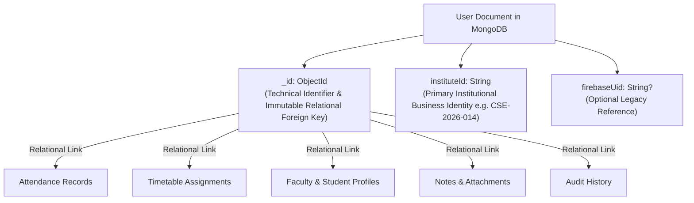
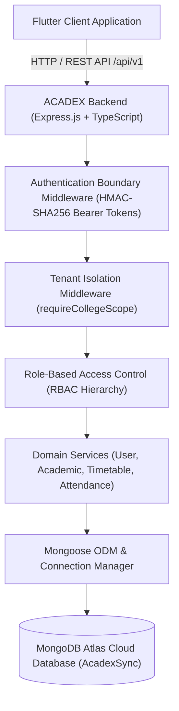
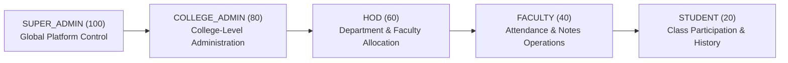

# ACADEX Backend Architecture & MongoDB Atlas Data Layer

## 1. Executive Summary
This document defines the architectural specification for the ACADEX Node.js + TypeScript Backend powered by MongoDB Atlas. It details the decoupled identity model (`instituteId` vs `_id`), multi-tenant model, domain schemas, role-based access control, indexing strategy, and future migration roadmap from Firebase.

---

## 2. Decoupled Identity Model (`instituteId` vs `_id`)

### Identity Rules
1. **`instituteId` is the Primary Institutional Identity**:
   - Unique across all users via MongoDB index `{ instituteId: 1 }`.
   - Modifiable by authorized institutional admins or HODs (e.g. roll number correction, lateral entry renumbering).
2. **MongoDB `_id` is the Technical Relational Key**:
   - All relational entities (`AttendanceRecord`, `AttendanceSession`, `Timetable`, `Note`, `Faculty`, `Student`, `AuditLog`) store the MongoDB `_id` / `userId`.
   - Modifying a user's `instituteId` updates the business identifier **without altering `_id`** and **without breaking any relational data or history**.
3. **Firebase UID is Not the Identity Authority**:
   - `firebaseUid` is an optional legacy migration reference field (`sparse: true`), ensuring MongoDB Atlas is the sole authoritative backend data source.

---

## 3. System Architecture Diagram

---

## 4. Multi-Tenant Architecture & College Isolation

ACADEX is a multi-tenant platform designed for multi-institution deployment.

### 4.1 Tenancy Rules
- Every operational document stores `collegeId: ObjectId` (referencing `College`).
- All queries issued by non-`SUPER_ADMIN` users are strictly scoped: `{ collegeId: req.user.collegeId }`.
- Client-provided `collegeId` is rejected if it does not match the authenticated user's token (`requireCollegeScope` middleware).
- Cross-college access attempts are rejected with `403 Forbidden`.

### 4.2 Compound Unique Constraints
- Users: `{ instituteId: 1 }` (unique globally), `{ email: 1 }` (unique globally)
- Departments: `{ collegeId: 1, code: 1 }` (unique within college)
- Courses: `{ collegeId: 1, departmentId: 1, code: 1 }` (unique within department)
- Semesters: `{ collegeId: 1, courseId: 1, academicYearId: 1, number: 1 }` (unique within academic year)
- Sections: `{ collegeId: 1, departmentId: 1, semesterId: 1, name: 1 }` (unique within semester)
- Subjects: `{ collegeId: 1, departmentId: 1, semesterId: 1, code: 1 }` (unique within semester)
- Students: `{ collegeId: 1, rollNumber: 1 }` (unique within college)
- Faculty: `{ collegeId: 1, employeeId: 1 }` (unique within college)
- Faculty Assignments: `{ collegeId: 1, facultyId: 1, sectionId: 1, subjectId: 1 }` (unique per class)

---

## 5. Role Model & Permission Matrix

---

## 6. Comprehensive Indexing Strategy

| Collection | Indexed Fields | Purpose & Optimization |
|---|---|---|
| `users` | `{ instituteId: 1 }` (unique), `{ email: 1 }` (unique), `{ firebaseUid: 1 }` (sparse), `{ collegeId: 1, role: 1 }` | Fast business ID lookup, email login, legacy migration, role filtering |
| `colleges` | `{ code: 1 }` (unique), `{ name: 1 }` | Unique college registration, alphabetical search |
| `departments` | `{ collegeId: 1, code: 1 }` (unique), `{ collegeId: 1, name: 1 }` | Tenant-scoped code uniqueness, department lookup |
| `courses` | `{ collegeId: 1, departmentId: 1, code: 1 }` (unique) | Department course listings |
| `academicYears` | `{ collegeId: 1, isCurrent: 1 }`, `{ collegeId: 1, name: 1 }` (unique) | Active term lookup, conflict prevention |
| `semesters` | `{ collegeId: 1, courseId: 1, academicYearId: 1, number: 1 }` (unique) | Semester sequence ordering |
| `sections` | `{ collegeId: 1, departmentId: 1, semesterId: 1, name: 1 }` (unique) | Section management & lookup |
| `subjects` | `{ collegeId: 1, departmentId: 1, semesterId: 1, code: 1 }` (unique) | Subject syllabus search & curriculum lookup |
| `faculty` | `{ collegeId: 1, employeeId: 1 }` (unique), `{ collegeId: 1, departmentId: 1 }` | Staff identification & department roster |
| `students` | `{ collegeId: 1, rollNumber: 1 }` (unique), `{ collegeId: 1, sectionId: 1 }` | Student identification & section rosters |
| `facultyAssignments`| `{ collegeId: 1, facultyId: 1, sectionId: 1, subjectId: 1 }` (unique) | Teaching workload lookup |
| `studentEnrollments`| `{ collegeId: 1, studentId: 1, semesterId: 1, sectionId: 1 }` (unique) | Enrollment tracking |
| `timetables` | `{ collegeId: 1, sectionId: 1, status: 1 }`, `{ collegeId: 1, departmentId: 1 }` | Active timetable retrieval |
| `attendanceSessions`| `{ collegeId: 1, sectionId: 1, subjectId: 1, date: 1 }` | Class attendance tracking & session history |
| `attendanceRecords` | `{ sessionId: 1, studentId: 1 }` (unique), `{ collegeId: 1, studentId: 1, date: 1 }` | Granular student attendance aggregation & reports |
| `notes` | `{ collegeId: 1, subjectId: 1, sectionId: 1, status: 1 }` | Subject notes repository |
| `notifications` | `{ recipientUserId: 1, isRead: 1 }`, `{ collegeId: 1, recipientRole: 1 }` | Real-time notification inbox |
| `auditLogs` | `{ collegeId: 1, entityType: 1, timestamp: -1 }`, `{ actorUserId: 1, timestamp: -1 }` | Compliance and change tracking |
